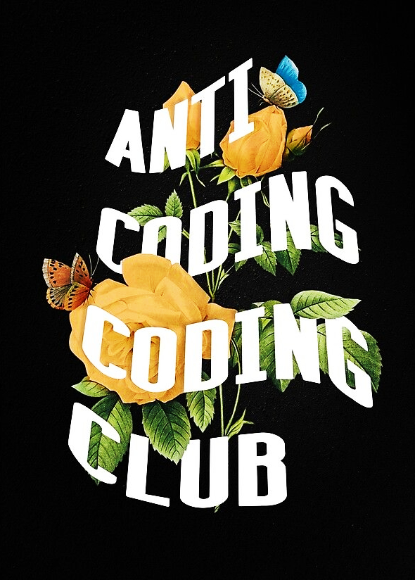

## setup

| Program            | Name                                                                                        |
| :----------------- | :------------------------------------------------------------------------------------------ |
| Linux Distribution | [Arch Linux](https://www.archlinux.org/)                                                    |
| Window Manager     | [bspwm](https://github.com/baskerville/bspwm)                                               |
| hotkey daemon      | [sxhkd](https://github.com/baskerville/sxhkd)                                               |
| Bar                | [polybar](https://github.com/jaagr/polybar)                                                 |
| Terminal Emulator  | [alacritty](https://github.com/alacritty/alacritty)                                         |
| File Manager       | [ranger](https://github.com/ranger/ranger)                                                  |
| Program Launcher   | [rofi](https://github.com/DaveDavenport/rofi)                                               |
| Wallpaper Setter   | [nitrogen](https://github.com/l3ib/nitrogen/)                                               |
| Code Editor        | [vscode](https://neovim.io/) (main) / [nvim](https://neovim.io) (for quick edit and etc...) |
| Shell              | [zsh](https://www.zsh.org/)                                                                 |
| Document Viewer    | [Zathura](https://pwmt.org/projects/zathura/)                                               |
| Icon theme         | [McMojave-circle](https://github.com/vinceliuice/McMojave-circle)                           |
| font               | [FiraCode Nerd Font](https://github.com/ryanoasis/nerd-fonts)                               |

## screenshots

#### Home

#### VSCode

#### Chrome NewTab / zathura / ranger

> install Clocks newTab from [here](https://github.com/rendinjast/clocks-newpage)

#### afetch / rofi / nvim

### Wallpaper

